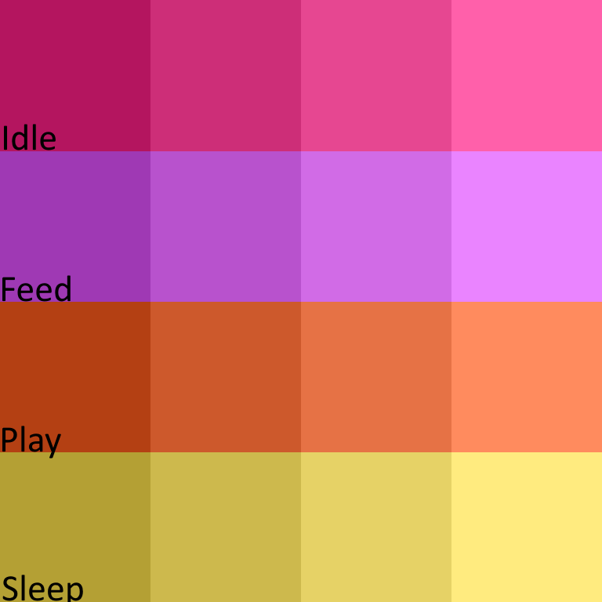

# Sylphian/UserPets
Give users of your Xenforo forum their own virtual pet.

## Customisable Bits

<strong>Spritesheet Template</strong>

## Requirements
- Xenforo 2.3.7
- PHP 8.3
- [Sylphian/Library 1.0.6](https://github.com/Sylphian-Network/Sylphian-Library)

## Credit
- [KoiRoylers for the level up audio.](https://pixabay.com/users/koiroylers-44305058/)